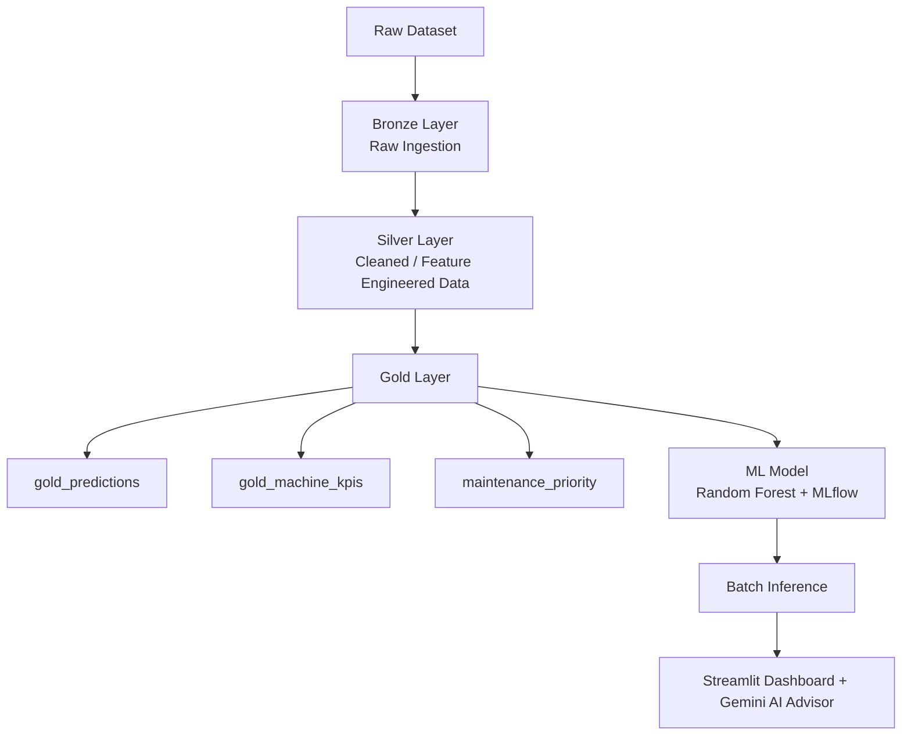

# Maintenance-Copilot-Databricks

  
  
  
  
  
  
  
  

  <b>A production-style predictive maintenance dashboard built with Databricks Lakehouse, Machine Learning, Streamlit, Plotly, and Gemini AI.</b>

---

## Overview

Predictive Maintenance Copilot is an end-to-end AI/ML project that helps identify machine risk levels, prioritize maintenance actions, and present insights through a real-time interactive dashboard.

The project combines:

- Databricks Lakehouse for data engineering
- Delta Lake with Bronze, Silver, and Gold architecture
- Random Forest model for predictive maintenance classification
- MLflow for experiment tracking
- Streamlit + Plotly for live dashboarding
- Gemini AI for grounded maintenance guidance

This project demonstrates how to build a practical AI application that connects data engineering, machine learning, visualization, and LLM-assisted decision support.

---

## Platforms Used

- **Platform:** Databricks
- **Frontend:** Streamlit
- **Programming Language:** Python
- **Database / Query Layer:** Databricks SQL
- **Storage Architecture:** Delta Lake
- **ML Tracking:** MLflow
- **Visualization:** Plotly
- **LLM Integration:** Gemini 3 Flash
- **Version Control:** GitHub

---

## Key Highlights

- Built a production-style predictive maintenance solution on Databricks Lakehouse
- Implemented Medallion Architecture: Bronze -> Silver -> Gold
- Trained a Random Forest model with **AUC = 0.954**
- Created a live Streamlit dashboard with multiple real-time charts
- Added KPI cards for machine volume, risk levels, and maintenance priorities
- Integrated Gemini AI to answer grounded maintenance questions
- Used filtered live Databricks data for dashboard insights
- Designed the system for portfolio, demo, and early production-style use

---

## Architecture

## Features
1.Live Dashboard
Real-time KPI cards

Risk distribution chart

Risk by machine type

Priority action analysis

Trend-based visual insights

Product search and risk filtering

2.Machine Learning Pipeline
Predictive maintenance classification

Random Forest model training

MLflow experiment tracking

Batch inference pipeline

AUC-based model performance reporting

3.AI Maintenance Advisor
Gemini-powered assistant

Grounded responses based only on provided dashboard data

Priority machine recommendations

Missing-data awareness

Safe response formatting for demo-ready outputs

4.Data Engineering
Bronze, Silver, Gold table pipeline

Databricks SQL integration

Delta Lake architecture

Real-time query-driven dashboard

## Gold Tables Used
default.gold_predictions
default.gold_machine_kpis
default.maintenance_priority

## Dashboard Metrics
The dashboard includes:
- Total Machines
- High Risk Count
- High Risk Percentage
- Medium Risk Count
- Priority Actions
- Model AUC
- Risk Distribution
- Machine Type Analysis
- Priority by Machine Type
- Trend Visualizations

## AI Advisor Example
The AI advisor answers questions such as:
- Which machines should I fix first?
- What are the highest priority maintenance items?
- Which product IDs are high risk?
- What information is missing from the current data?
- It is designed to stay grounded in the actual data passed from the dashboard instead of generating unsupported claims.

## Tech Stack
- Python
- Streamlit
- Plotly
- Pandas
- Databricks SQL
- Delta Lake
- MLflow
- Gemini API
- GitHub

## Run Locally
- git clone https://github.com/anchitchourasia/maintenance-copilot-app.git
- cd maintenance-copilot-app
- pip install -r requirements.txt
- streamlit run app.py

## Environment Variables
- Create a .env file in the project root:
- DATABRICKS_HOST=your_databricks_host
- DATABRICKS_HTTP_PATH=your_http_path
- DATABRICKS_TOKEN=your_databricks_token
- GEMINI_API_KEY=your_gemini_api_key

## Results
- Use Case: Predictive Maintenance
- Model: Random Forest Classifier
- AUC Score: 0.954
- Deployment Style: Databricks App + Streamlit
- Strength: End-to-end ML + dashboard + LLM integration

## Future Improvements
- Real-time streaming predictions
- Role-based dashboard access
- Alerting and notification workflows
- Deeper root-cause analysis
- More advanced model comparison
- Exportable maintenance reports
